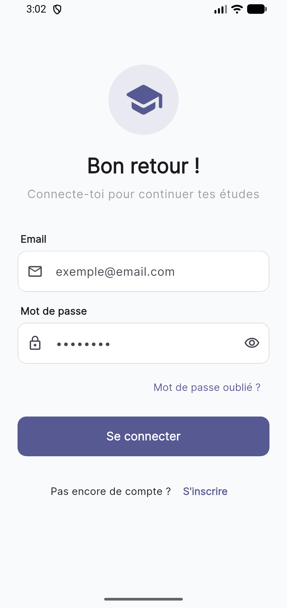
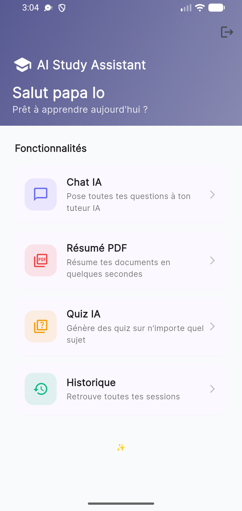
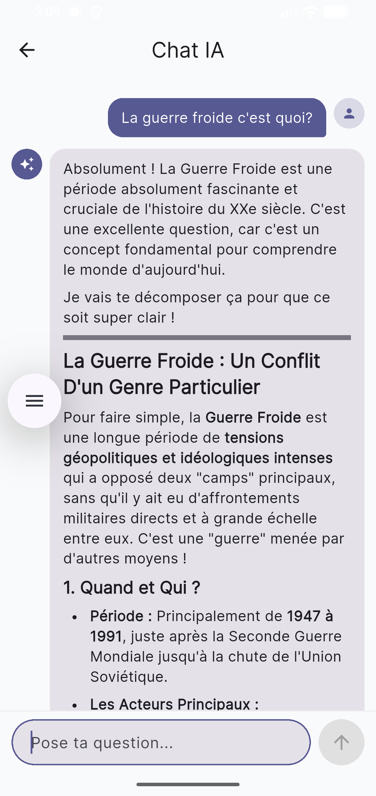
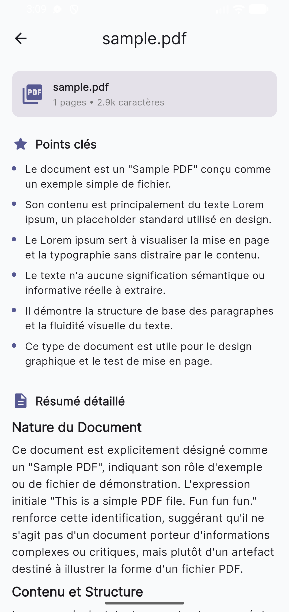
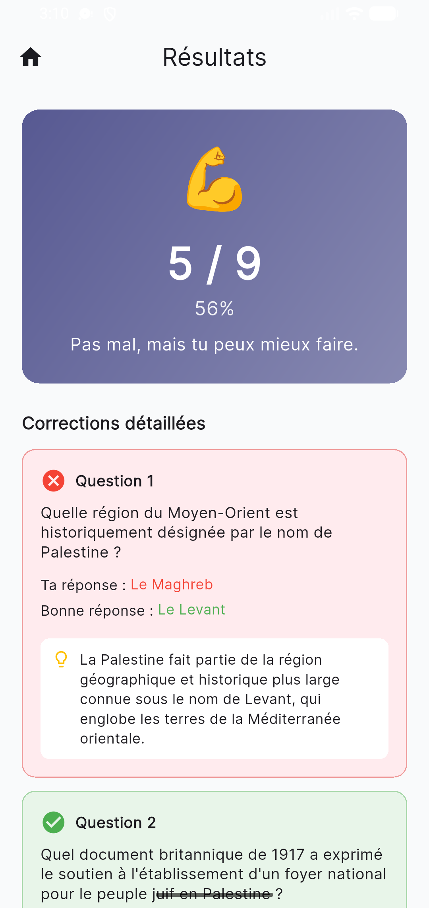

# 📚🤖 AI Study Assistant

> An AI-powered study companion built with Flutter, Firebase, and Google Gemini

[](https://flutter.dev)
[](https://firebase.google.com)
[](https://ai.google.dev)
[](LICENSE)

A complete mobile application that helps students learn smarter with AI: chat with an AI tutor, summarize PDFs, and generate custom quizzes. All sessions are saved to the cloud for cross-device access.

---

## 📥 Try it now

👉 **[Download the latest APK](https://github.com/Magatte-lo/ai_study_assistant/releases/latest)** (Android 6.0+)

---

## ✨ Features

| Feature | Description |
|---------|-------------|
| 🔐 **Authentication** | Email/password sign up with persistent sessions |
| 💬 **AI Chat** | Conversational tutor with full message history |
| 📄 **PDF Summarizer** | Upload a PDF, get a structured summary with key points |
| 🧠 **Quiz Generator** | Custom quizzes on any topic with difficulty levels |
| 📊 **Unified History** | All your chats, summaries, and quizzes in one place |
| 🎨 **Material 3 Design** | Modern UI with dark mode support |

---

## 📸 Screenshots

<table>
  <tr>
    <td align="center"><b>Login</b></td>
    <td align="center"><b>Home</b></td>
    <td align="center"><b>AI Chat</b></td>
  </tr>
  <tr>
    <td></td>
    <td></td>
    <td></td>
  </tr>
  <tr>
    <td align="center"><b>PDF Summary</b></td>
    <td align="center"><b>Quiz</b></td>
    <td align="center"><b>History</b></td>
  </tr>
  <tr>
    <td></td>
    <td></td>
    <td></td>
  </tr>
</table>

---

## 🏗️ Architecture

The project follows a **Clean Architecture** with a **feature-first** structure for scalability and testability.
lib/
├── core/                      # Shared code (theme, services, errors)
│   ├── constants/
│   ├── theme/
│   ├── errors/
│   └── services/              # AI service abstraction (Gemini, OpenAI...)
│
├── features/                  # One folder per feature
│   ├── auth/                  # Authentication
│   │   ├── data/              # AuthRepository (Firebase)
│   │   ├── domain/            # UserModel
│   │   └── presentation/      # Pages, widgets, providers
│   │
│   ├── chat/                  # AI Chat
│   ├── pdf_summary/           # PDF Summarization
│   ├── quiz/                  # Quiz Generator
│   └── history/               # Unified history
│
├── app.dart                   # MaterialApp + theme
└── main.dart                  # Entry point + Firebase init

### Key architectural decisions

- **Riverpod** for state management — type-safe, testable, modular
- **Repository pattern** — UI never talks directly to Firebase or APIs
- **AIService abstraction** — Easy to swap Gemini for OpenAI, Claude, or any LLM in one place
- **Sealed classes** for state modeling (idle → loading → success / error)
- **Stream-based reactivity** — Firestore changes update the UI in real time

---

## 🛠️ Tech Stack

| Layer | Technology |
|-------|-----------|
| **UI** | Flutter (Material 3) + Google Fonts |
| **State management** | flutter_riverpod 2.x |
| **Authentication** | firebase_auth |
| **Database** | Cloud Firestore |
| **AI** | Google Gemini 2.5 Flash via REST API |
| **HTTP** | Dio |
| **PDF processing** | syncfusion_flutter_pdf (local extraction) |
| **File picking** | file_picker |
| **Markdown rendering** | flutter_markdown |
| **Environment variables** | flutter_dotenv |

---

## 🚀 Getting Started

### Prerequisites

- Flutter SDK (3.x or higher)
- Android Studio / VS Code with Flutter plugin
- A Firebase project ([create one here](https://console.firebase.google.com))
- A Google Gemini API key ([get one here](https://aistudio.google.com/apikey))

### Installation

1. **Clone the repo**
```bash
   git clone https://github.com/Magatte-lo/ai_study_assistant.git
   cd ai_study_assistant
```

2. **Install dependencies**
```bash
   flutter pub get
```

3. **Configure Firebase**
```bash
   dart pub global activate flutterfire_cli
   flutterfire configure
```
This generates `lib/firebase_options.dart`.

4. **Enable Firebase services**
    - **Authentication** → Email/Password
    - **Firestore Database** → start in production mode
    - Configure the security rules (see `firestore.rules` in the repo)

5. **Create a `.env` file** at the project root:
```env
   GEMINI_API_KEY=your_gemini_api_key_here
```

6. **Run the app**
```bash
   flutter run
```

---

## 🔐 Firestore Security Rules

```javascript
rules_version = '2';
service cloud.firestore {
  match /databases/{database}/documents {
    match /users/{userId} {
      allow read, write: if request.auth != null && request.auth.uid == userId;

      match /chat_sessions/{sessionId} {
        allow read, write: if request.auth != null && request.auth.uid == userId;
        match /messages/{messageId} {
          allow read, write: if request.auth != null && request.auth.uid == userId;
        }
      }

      match /pdf_summaries/{summaryId} {
        allow read, write: if request.auth != null && request.auth.uid == userId;
      }

      match /quizzes/{quizId} {
        allow read, write: if request.auth != null && request.auth.uid == userId;
      }
    }
  }
}
```

---

## 🧠 How the AI features work

### Chat
The conversation history (user + AI messages) is sent at each turn so the model keeps context. The system prompt encourages structured, pedagogical answers in markdown.

### PDF Summary
1. The user picks a PDF locally — **the file never leaves their device**
2. `syncfusion_flutter_pdf` extracts the raw text
3. The text is sent to Gemini with a strict JSON system prompt
4. Gemini returns `{ summary, keyPoints }` which we store in Firestore
5. The original PDF is **not** stored — only the AI-generated summary

### Quiz
1. The user provides a topic + difficulty + number of questions
2. Gemini is prompted to return strict JSON with `{ question, options, correctIndex, explanation }`
3. The quiz is saved, then the user plays it
4. Score and answers are tracked for review

---

## 🛣️ Roadmap

- [ ] Google Sign-In
- [ ] Dark mode toggle in settings
- [ ] Export quizzes / summaries to PDF
- [ ] OCR support for scanned PDFs
- [ ] Multi-language support (English, Arabic, Wolof)
- [ ] iOS support

---

## 🤝 Contributing

Contributions are welcome! Open an issue first to discuss your idea.

---

## 📄 License

This project is licensed under the MIT License — see [LICENSE](LICENSE) for details.

---

## 👤 Author

**Pape Magatte Lo**

- GitHub: [@Magatte-lo](https://github.com/Magatte-lo)

---

## 🙏 Acknowledgements

- [Flutter](https://flutter.dev) — for the amazing cross-platform framework
- [Firebase](https://firebase.google.com) — for the backend infrastructure
- [Google Gemini](https://ai.google.dev) — for the AI capabilities
- [Riverpod](https://riverpod.dev) — for state management

---

⭐ **If you find this project useful, please give it a star!** It helps a lot.
